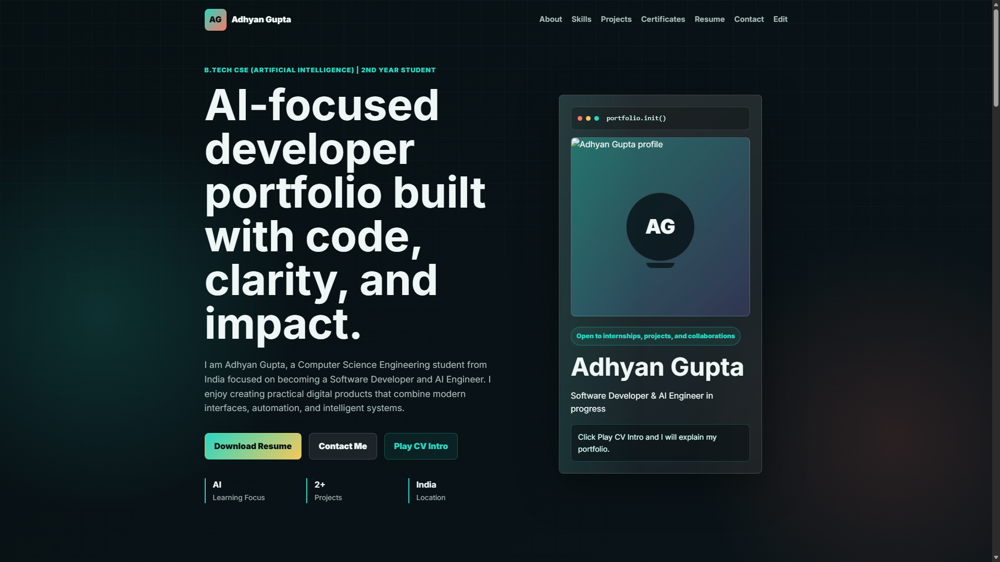

# Portfolio Steps

## Live Demo Preview

Open `index.html` to view the portfolio.

Open `admin.html` to edit content.

## Upload Options

In `admin.html`, you can:

- Upload profile image for the animated speaking avatar
- Upload CV / resume PDF
- Upload certificates as images or PDFs
- Edit skills, projects, achievements, contact links, and profile text

After uploading or editing, click `Save Changes`, then refresh `index.html`.

## Important

This editor saves data in your browser using localStorage. It is good for personal editing and preview.

For public permanent editing after hosting, use Firebase Auth, Firestore, and Firebase Storage.
